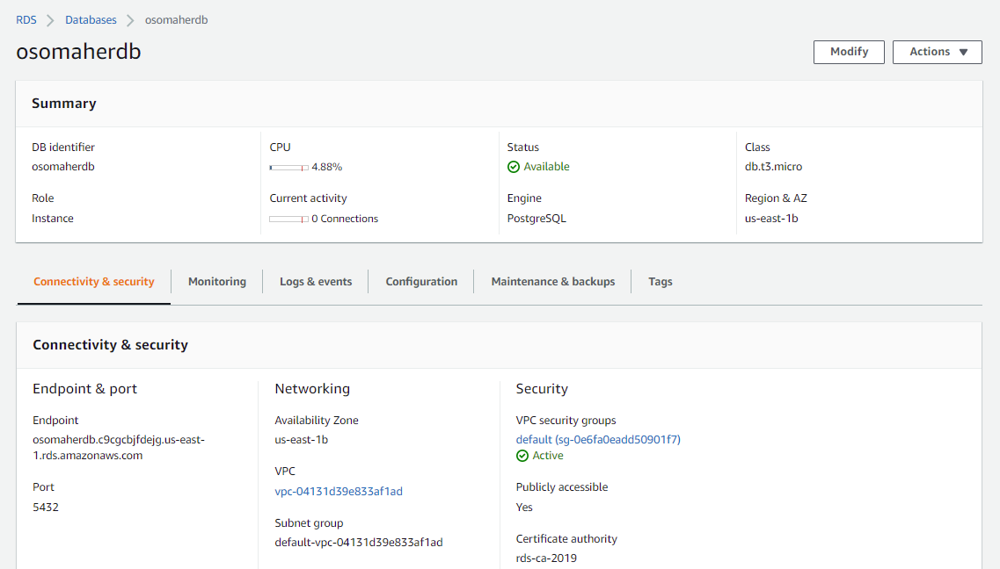
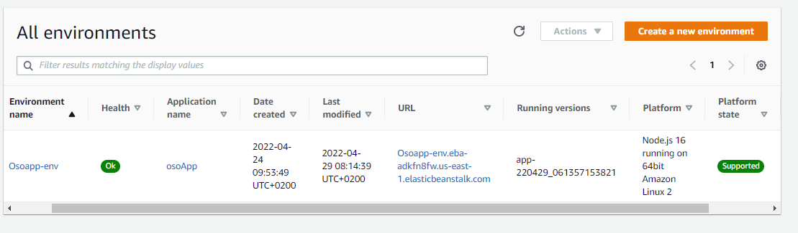
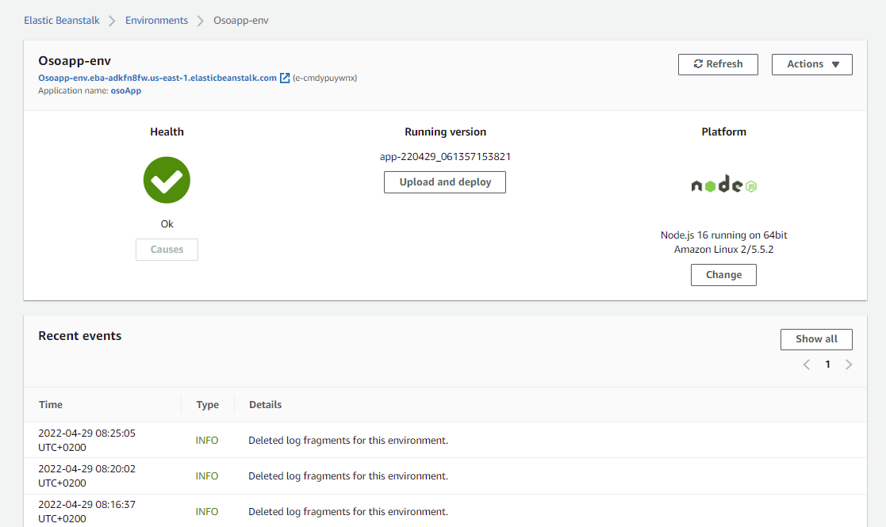
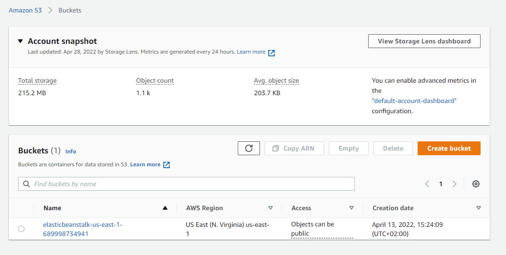
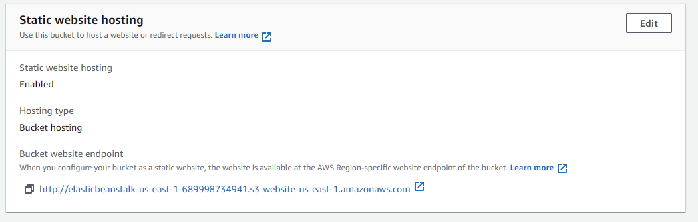

# AWS cloud Infrastructure
1. RDS service using `PostgreSql` running `osomaherdb` DB instance

   

2. EB environment `Osoapp-env-1` using `Node.js 16 running on 64bit Amazon Linux 2/5.5.2` running an application `osoApp`

   
   

3. S3 bucket which is **public** `elasticbeanstalk-us-east-1-689998734941` hosting the front end UI files

   
   

> ** All AWS services are accessed via IAM.

---

## Architecture diagram in: [Diagram](architecture_diagram.md)