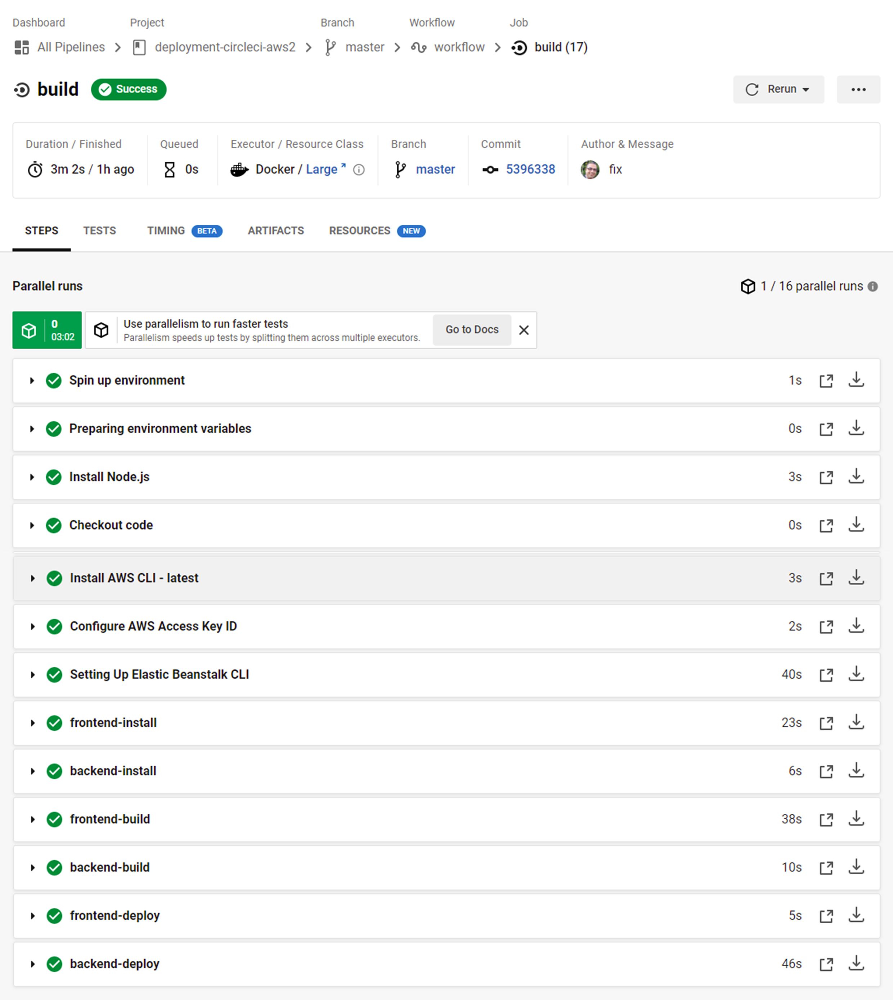
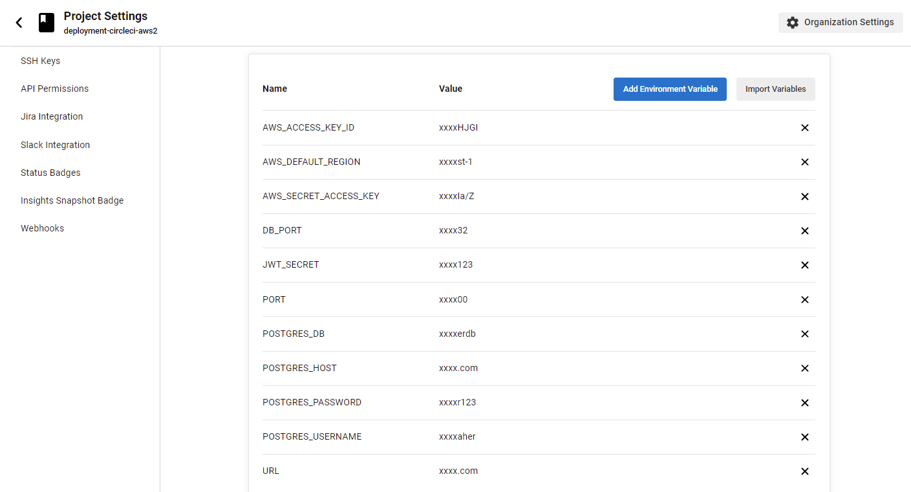

# Pipeline Process
The application is connected to `github` on repository: https://github.com/osomaher2020/deployment-circleci-aws2

Branch: `master`

Which is used by CircleCI for CI/CD following a deployment steps as:

1. prepare needed executors and environment
    - node: circleci/node@5.0.2
    - aws-cli: circleci/aws-cli@3.1.0
    - aws-elastic-beanstalk: circleci/aws-elastic-beanstalk@2.0.1
2. run jobs in order:
    - frontend-install
    - backend-install
    - frontend-build
    - backend-build
    - frontend-deploy
    - backend-deploy



---
## Deploying the Backend API:
executes the script in `udagram-api/bin/deploy.sh` which contains steps to deploy on AWS EB:
```
eb init Osoapp --platform node.js --region us-east-1
eb use Osoapp-env-1
eb deploy Osoapp-env-1
```

AWS EB API: http://Osoapp-env-1.eba-adkfn8fw.us-east-1.elasticbeanstalk.com/api/v0

---
## Deploying the Frontend UI:
executes the script in `udagram-frontend/bin/deploy.sh` which contains steps to deploy on AWS S3:
```
aws s3 cp --recursive --acl public-read ./www s3://elasticbeanstalk-us-east-1-689998734941/
```

AWS S3 static website: http://elasticbeanstalk-us-east-1-689998734941.s3-website-us-east-1.amazonaws.com

---

# CircleCi Environment variables


